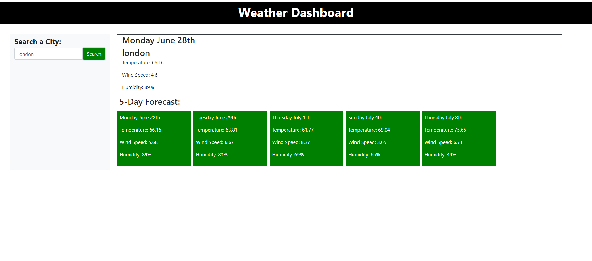

# todays-weather-dashboard

## Task
    The task for this project was to create a weather dashboard that takes the users input and searchs the city name and produces the weather for the day and the five day forecast.

## The Project
    For this project we needed to create a functioning weather dashboard that would allow the user to search for any city and it would give them the weather for the day along with the 5 day forecast. The weather provided includes temperature, wind speed and humidity. This is a pretty simple project that works with web API's, to get all the data for the weather we needed to pull the data from an API that already has the data ready for us. We just need to know how to call the data down to our website and populate it on the users screen.